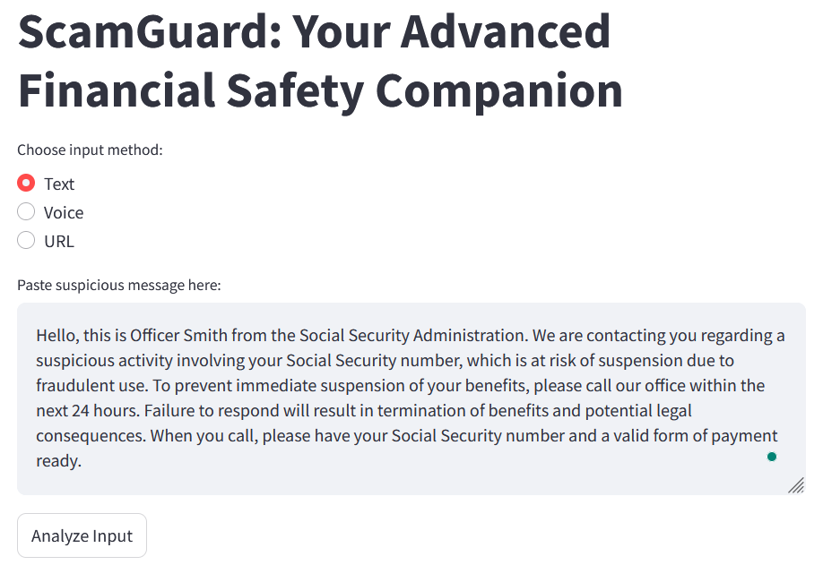
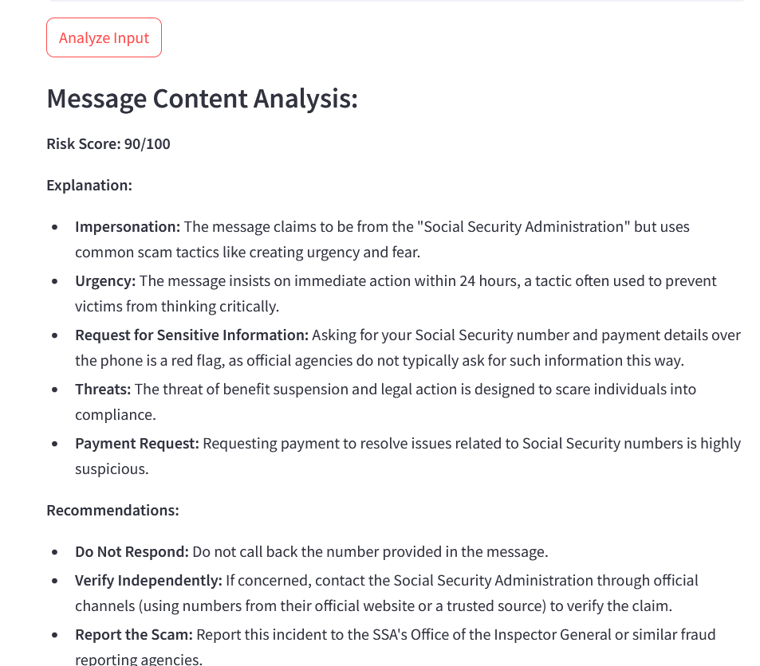

### ScamGuard: Your Advanced Financial Safety Companion 🤖
 - Developed ScamGuard to act as a digital sentinel, helping users make informed decisions about the safety of messages, links, and online content they encounter.

## Usage ⏳
To start the app, use:
```bash
streamlit run helping_people.py
```

## Key Features ✨
- Multi-Modal Input Processing
- URL Security Analysis
- Geolocation Intelligence
- Risk Assessment
- Scam Detection
- Text to Speech, Audio playback

## Screenshots 📷



## Configuration ⚙️
 - Get your xAI API key from [x.ai](https://x.ai)
 - Map data provided by OpenStreetMap contributors

## Author 😇
- **Author**: Jahid Hasan

## Organized by 🚩
 - Dr. Wei Zhang, Ivy Hackathon, Ivy College of Business, Iowa State University
